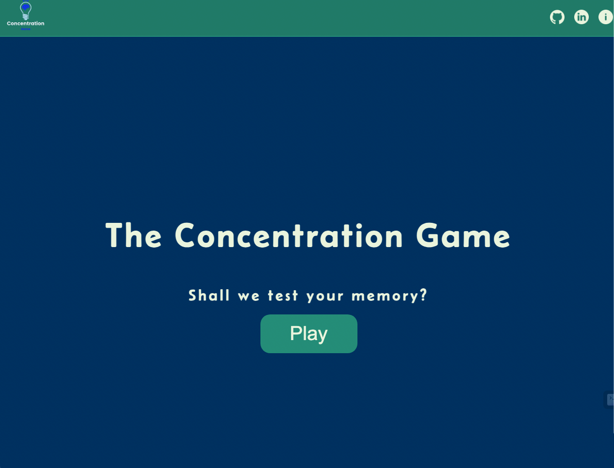
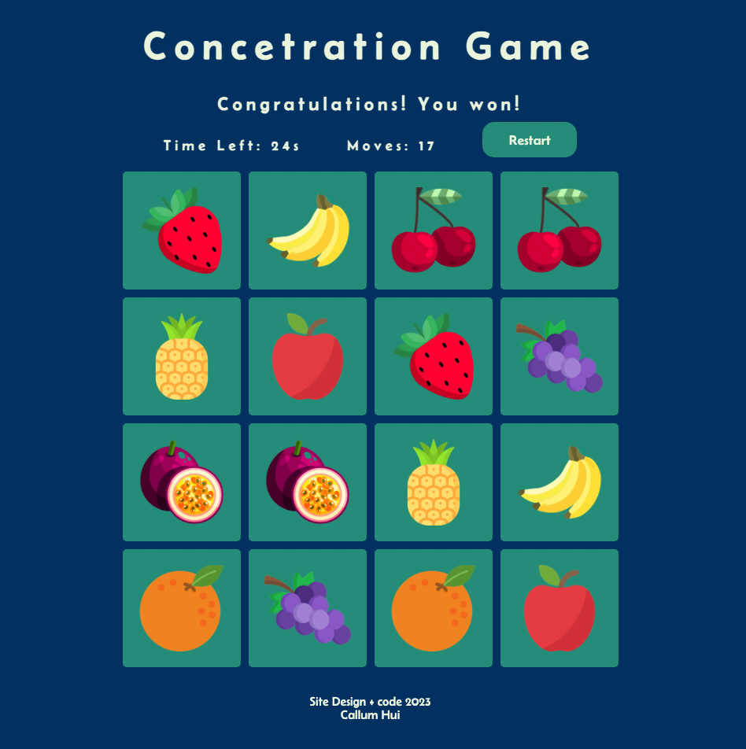

# Concentration Game

Concentration Game is a memory-based card matching game where players have to flip cards and find matching pairs. The objective of the game is to match all the pairs within a certain time limit.

## What the finished project looks like

## Features

- Flip cards to reveal their hidden images.
- Match pairs by finding cards with the same image.
- Timer countdown to add excitement and challenge.
- Move counter to see how many moves it takes you to win.
- Game status updates to provide feedback to the player.
- Restart button to start a new game.

## Technologies Used

- HTML
- CSS
- JavaScript
- Git Hub
- Visual Studio Code 
- Command Line
- Image source: [flaticon.com ](https://www.flaticon.com/)
- Wireframing tool: https://excalidraw.com/ 

## Setup and Usage

1. Follow this link: https://callumwhhui.github.io/SEI-Project-1/
3. Press play when you're ready to start playing.
4. The game will start automatically.
5. Click on the cards to flip them and try to match all the pairs.
6. The timer will count down, and the game status will update accordingly.
7. If you complete the game within the time limit, a winning message will be displayed.
8. To restart the game, click on the "Restart" button.

## Timeframe & Working Team 

This project was worked on soley by me. I was given 5 days to complete this project and this project was completed within 5 days.

## Project Planning - Wireframes 

## Future Improvements 

- Select difficulty.
  1. decrease time to beat game.
  2. increase amount of cards.
  
- display highscores. 

## Customization

- To customize the images used in the game, replace the existing images in the `projectimgs` folder with your own images. Make sure the image filenames match the values assigned to the `data-img` attributes of the card elements in the HTML.
- You can modify the game's appearance by modifying the CSS styles in the `main.css` file.

## Contributions

Contributions to the project are welcome! If you find any issues or would like to suggest enhancements, feel free to submit a pull request.
